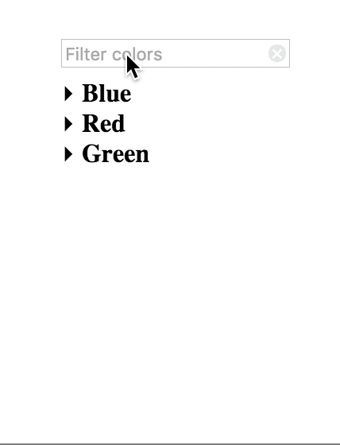

# Accordion Live Filter

jQuery plugin to live filter an accordion list.

## Getting Started

Download the css file and the js file from the [dist](dist/) folder (you'll see that they're already minified for you).  If you'd like
you can also grab the un-minified, commented versions in the [src](src/) folder.  Next, include the css file in the head of your
webpage, and the js file in the footer.  Finally, make a call to start the script.

For example, you may try this:

    <html>
      <head>
        <title>My Site!</title>
        <!-- more stuff ... -->
        <link rel="stylesheet" src="css/accordion-live-filter.min.css">
      </head>
      <body>
        <h1>Things!</h1>
        <input class="alf-filter" data-alf="#alf-menu" placeholder="Filter!">
        <ul id="alf-menu" class="alf-filterable">
          <li>
            <label>Category 1</label>
            <ul>
              <li>Item 1</li>
              <li>Item 2</li>
            </ul>
          </li>
          <!-- rinse and repeat -->
        </ul>
        
        
      </body>
    </html>
    
For a more indepth, working example, check out the [demo](demo/demo.html).

## Options/Requirements

There are some required structure of the dom elements as well as some particular attributes that are necessary.

### Mark up

First, the filter input field must have a data attribute that has the jQuery selector for the associated accordion.  By 
default, this is `data-alf` but can be customized with the call to the plugin (detailed later).

The accordion should have a class that dictates the actual layout of the accordion.  In this case, the default in the css
file is `alf-filterable` - this indicates that this particular element is filterable and also sets up the style for the 
accordion.

Properly nested ul/li elements should be used for the accordion.  A category should be indicated by a label element with its
associated values below it.

When searching, a class of `alf-matched` is added to an element which by default is bolded.  This style can be overriden
as well as the class in the plugin options below.

The class of `alf-expanded` is added to label elements when their child list is expanded.  This can also be changed in the
plugin options - but make sure to adjust your source CSS then.

A filter input clear button is added dynamically using javascript.  The class by default is `alf-filter-clear` but can be
changed in the plugin options.  Make sure to create appropriate CSS for this element if you change the class name.

### Plugin Options

The plugin allows an options object to be passed in for each instance it is applied to.  The options are as follows:

| Option | Default | Description |
|---|---|---|
| dataAccordionReference | alf  | This string is appended to `data-` to make a data attribute that holds the selector for the associated accordion.  By default, the `alf` example means an element of `data-alf` will be used. |
| clearFilterClass | alf-filter-clear | This class is used in both the CSS to position the filter input clear button, as well as the javascript to indicate that this button is used to clear the filter element. |
| matchedClass | alf-matched | This class is assigned to an elemenet when the filtering has matched a partial or whole part of the element. |
| expandedClass | alf-expanded | This class is assigned to the label element when its child is expanded |

For example, if you'd like to apply this plugin to an element with the id of `my-filter-input` but make the matched class be `my-matched`, you would do the following:

    $('#my-filter-input').accordionLiveFilter({matchedClass: 'my-matched'});
    
Remember to alter your CSS to properly style the matched element using this new class, however!

## Known Issues / Limitations

Currently, this only supports IE 11+, Firefox, Chrome, Safari. It has not been tested on any other browser.

This only supports one level of nested, filterable items.  It may work but is not currently supported at this time.  (Pull requests are very welcome, though!)
